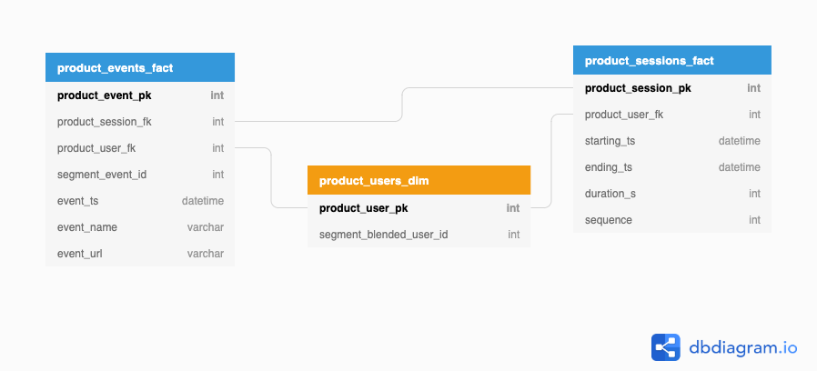

# The dbt's Product Warehouse
The dbt product warehouse package provides standard flexible product analytics directly in your data warehouse.

Our goal is to provide a set of models that will allow you to build analytics such as the ones found in SaaS tools such as Amplitude, Mixpanel and Heap. But it will allow more flexibility to go deeper into your data, plus easily join other sources of data for further analysis.

Our ERD so far looks like the following:



# What this package includes
The package creates a product warehouse which contains the following set of models:
- `warehouse/w_product/wh_product_users_dim.sql` - Users of your product
- `warehouse/w_product/wh_product_events_fact.sql` - Events generated by your users
- `warehouse/w_product/wh_product_sessions_fact.sql` - Sessions on your product by users

In our next iterations of development, we will introduce the following models:
- `warehouse/w_product/wh_product_attributions_xa.sql` - Conversion events attribution
- `warehouse/w_product/wh_product_metrics_xa.sql` - Packaged metrics generated on product
- `warehouse/w_product/wh_product_funnels_xa.sql` - Funnels and paths completed by users

Our DAG looks like the following:
...


# Setup
- Add the following to your `packages.yml` file:
```
packages:
  - git: "https://github.com/lantrns-analytics/dbt_product_warehouse.git"
    revision: 0.1 #
```
- You'll need to have the `dbt_utils` and `segment` packages installed, with a version of at least `0.5.0`
- You'll need to provide values for the following variables in your `dbt_project.yml` file
  - `cdp`: This is the name of the customer data platform used. Default value is `segment`
  - `cdp-events-model`: This points to your model of events. Default value is `segment_web_page_views`
  - `cdp-sessions-model`: This points to your model of sessions. Default value is `segment_web_sessions`
- Install the package with `dbt deps`


# Limitations
- We currently source event data that streams from Segment only.
- Functions are Snowflake specific.
